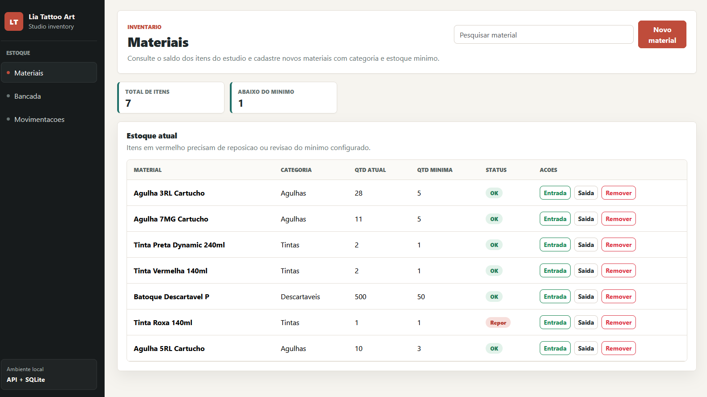
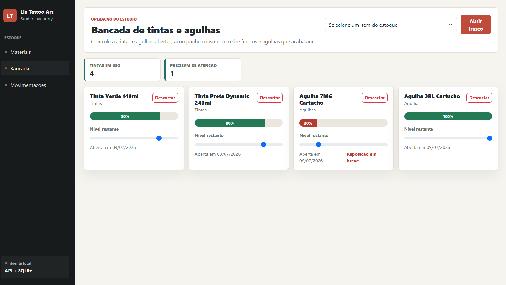
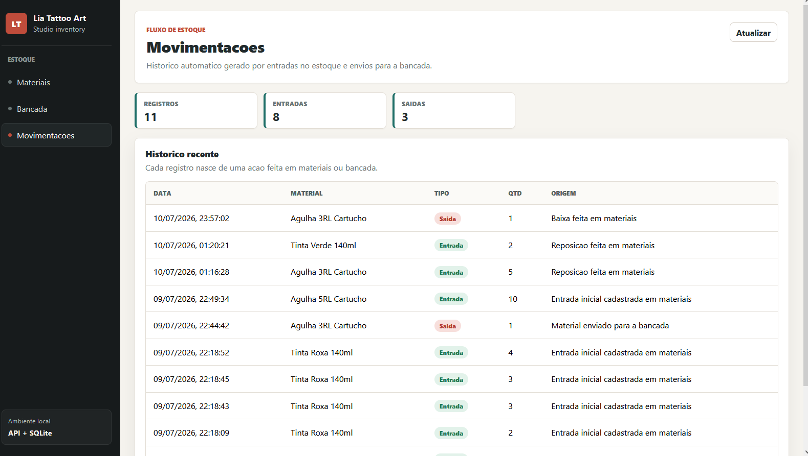

# Lia Tattoo Art - Controle de Estoque

Sistema full-stack para controle de estoque de um estúdio de tatuagem. A aplicação centraliza materiais, tintas em uso na bancada e movimentações automáticas de entrada e saída, ajudando a acompanhar saldo atual, itens abaixo do mínimo e histórico operacional.

Este projeto foi desenvolvido como estudo prático de integração entre front-end React e uma API ASP.NET Core, com foco em organização de código, separação de responsabilidades e persistência com Entity Framework Core.

## Demonstração Visual

> As imagens abaixo podem ser atualizadas com capturas reais da aplicação rodando localmente.

| Materiais | Bancada | Movimentações |
| --- | --- | --- |
|  |  |  |

## Funcionalidades

- Cadastro e listagem de materiais do estoque
- Controle de quantidade atual e quantidade mínima
- Identificação visual de itens abaixo do mínimo
- Organização dos materiais por categoria
- Registro de entradas e saídas de estoque
- Histórico automático de movimentações
- Controle de tintas abertas na bancada
- Atualização do nível restante das tintas em uso
- Remoção lógica de materiais, preservando o histórico

## Tecnologias

### Backend

- C#
- ASP.NET Core Web API
- Entity Framework Core
- SQLite
- Migrations
- Injeção de dependência
- DTOs para respostas da API

### Frontend

- React
- Vite
- Axios
- React Router DOM
- Bootstrap

## Arquitetura

O projeto está organizado como um monorepo com duas aplicações principais:

```txt
LiaTattooArt-monorepo/
  backend/
    EstoqueLiaTattoo.slnx
    EstoqueLiaTattoo/
      Controllers/
      Data/
      DTOs/
      Models/
      Services/
      Migrations/
  frontend/
    src/
      api/
      pages/
      services/
```

Fluxo geral da aplicação:

```txt
React + Vite
    |
    | chamadas HTTP via Axios usando /api
    v
ASP.NET Core Web API
    |
    | regras de negócio em Services
    v
Entity Framework Core
    |
    v
SQLite
```

## Decisões Técnicas

- O front-end consome a API por HTTP, simulando uma separação real entre cliente e servidor.
- O Vite usa proxy para redirecionar chamadas `/api` para a API local em desenvolvimento.
- A camada de serviços concentra regras de negócio como movimentação de estoque e abertura de tintas.
- As respostas principais da API usam DTOs para evitar expor diretamente as entidades do Entity Framework.
- Materiais removidos são desativados logicamente para preservar o histórico de movimentações.

## Como Rodar o Backend

Entre na pasta da API:

```powershell
cd backend\EstoqueLiaTattoo
dotnet restore
dotnet ef database update
dotnet run --launch-profile https
```

O comando `dotnet ef database update` cria o banco SQLite local e aplica as migrations.

A API deve ficar disponível em:

```txt
https://localhost:7153
http://localhost:5207
```

## Como Rodar o Frontend

Em outro terminal:

```powershell
cd frontend
npm install
npm run dev
```

Abra no navegador:

```txt
http://localhost:5173
```

## Comunicação Frontend e Backend

O front-end chama endpoints usando `/api`. Em desenvolvimento, o Vite redireciona essas chamadas para a API:

```txt
/api/materiais -> https://localhost:7153/api/materiais
```

## Exemplos de Endpoints

```txt
GET    /api/materiais
POST   /api/materiais
DELETE /api/materiais/{id}

GET    /api/movimentacoes
POST   /api/movimentacoes

GET    /api/tintas
POST   /api/tintas/abrir/{materialId}
PUT    /api/tintas/{id}/nivel
DELETE /api/tintas/{id}
```

## Aprendizados do Projeto

- Estruturar uma aplicação full-stack com front-end e back-end separados.
- Criar uma API REST com ASP.NET Core e Entity Framework Core.
- Aplicar migrations e persistência com SQLite.
- Consumir uma API no React usando Axios.
- Organizar regras de negócio em serviços no back-end.
- Trabalhar com DTOs para melhorar o contrato entre API e front-end.
- Pensar em histórico de movimentações como parte importante de um sistema de estoque.

## Próximas Melhorias

- Adicionar autenticação para separar perfis de usuário.
- Criar testes automatizados para regras de estoque.
- Adicionar filtros avançados no histórico de movimentações.
- Criar dashboard com indicadores de estoque crítico e consumo.
- Publicar uma versão demonstrável da aplicação.

## Status

Projeto em evolução, desenvolvido para estudo e portfólio.
